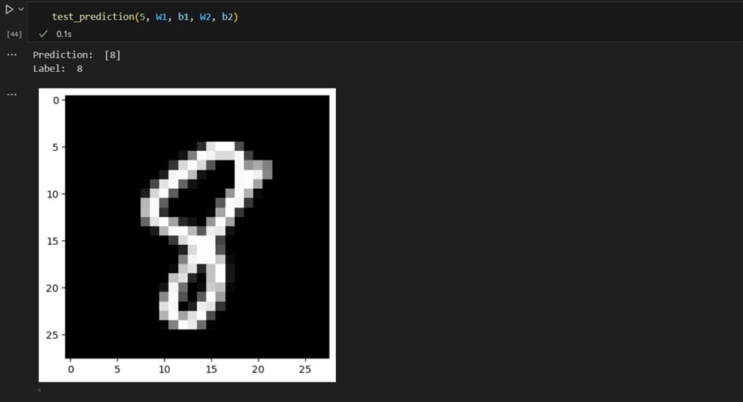

# I. Convolutional Neural Network Architecture

Convolutional Neural Network (CNN) is the extended version of artificial neural networks (ANN) which is predominantly used to extract the feature from the grid-like matrix dataset. For example visual datasets like images or videos where data patterns play an extensive role.

#### CNN Architecture consists of the following layers:
1. Input Layer
2. Convolutional Layer
3. Activation Layer
4. Pooling Layer
5. Flattening
6. Fully Connected Layer
7. Output Layer

In order to understand the architecture better, lets take an image and apply the convolution layer, activation layer, and pooling layer operation to extract the inside feature.

### Here is the Output:

# II. Building a Neural Network from Scratch without using Tensorflow with just Numpy and Math.
#### Dataset used: MNIST Dataset

#### Concepts Covered:
- Linear Algebra 
- Matrix Operations
- Transpose 
- Derivatives
- Forward Propagation
- Backward Propagation

### Output:

